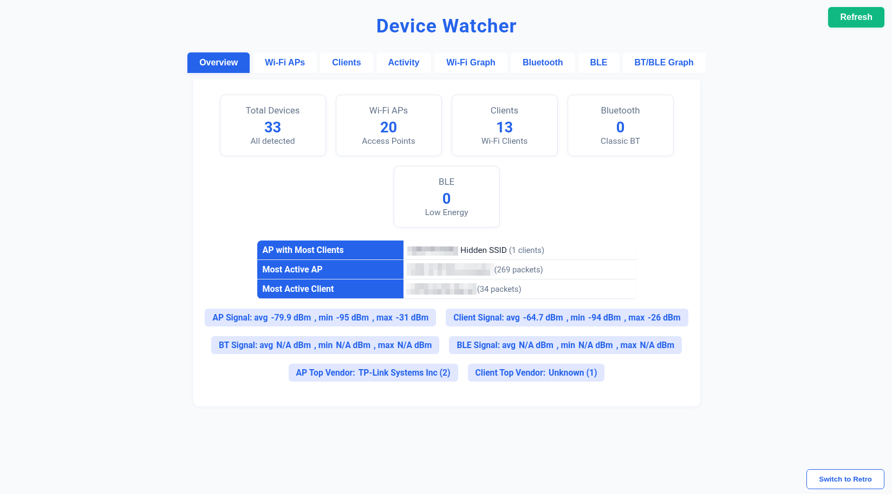
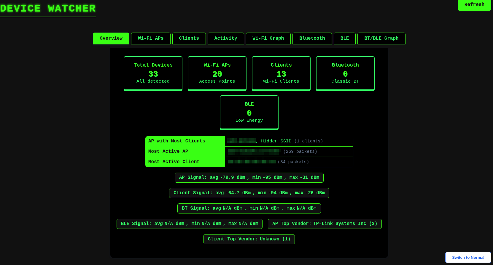

# DeviceWatcher

This is a Flask-based dashboard that monitors and visualizes data from Wi-Fi, Bluetooth Classic, and BLE (Bluetooth Low Energy) interfaces. The collected data is stored in a database and can be accessed via a web interface.

## Features

- Wi-Fi access point and client/devices monitoring
- Bluetooth Classic device scanning
- BLE device scanning
- Web dashboard to visualize detected devices
- Configurable via command-line arguments
- Modular, with optional interface support
- MAC address vendor finder

## Requirements

- Python 3.8+
- Flask
- Airmon-ng or similar tools for Wi-Fi monitor mode (if using Wi-Fi monitoring)
- Required Bluetooth tools (`bluez`, etc.)
- Appropriate system permissions to access network interfaces

## Installation

1. Clone the repository:

```bash
git clone https://github.com/ManuRebelo/DeviceWatcher.git
cd DeviceWatcher
```

2. Create virtual environment and install dependencies:

```bash
python3 -m venv venv
source ./venv/bin/activate
pip install -r requirements.txt
```

3. Ensure required system tools (e.g., `airmon-ng`, `hcitool`, etc.) are installed and accessible. If you are using Wi-Fi make sure your interface is in monitor mode.

## Usage

You can specify which interfaces to activate via command-line arguments:

```bash
python DeviceWatcher.py [--wifi <interface>] [--bt <index>] [--ble <index>]
```

### Examples

Start all three monitors:

```bash
python DeviceWatcher.py --wifi wlan1mon --bt 2 --ble 0
```

Only start Wi-Fi monitoring:

```bash
python DeviceWatcher.py --wifi wlan1mon
```

Only start BLE monitoring:

```bash
python DeviceWatcher.py --ble 0
```

If an argument is not provided, the corresponding monitor will not be started.

## Web Interface

Once running, open your browser and navigate to:

```
http://localhost:5000
```

You will see a dashboard displaying the monitored data.





## File Structure

```
.
├── DeviceWatcher.py          # Main Flask app
├── templates/
│   └── index.html            # Dashboard template
├── static/
│   │── main.css              # main css
│   └── retro.css             # retro css
├── wifi_monitor.py           # Wi-Fi monitor logic
├── bluetooth_classic_monitor.py # Bluetooth Classic monitor logic
├── ble_monitor.py            # BLE monitor logic
├── database_manager.py       # DB interface
├── utils.py                  # Helper functions
├── requirements.txt          # Python dependencies
└── README.md                 # You're reading it!
```

## Notes

- Root or elevated privileges are typically required to access Wi-Fi and Bluetooth interfaces.
- Interface names and indices depend on your hardware and OS. Use `iwconfig`, `hcitool dev`, or similar tools to check.
- You can add MAC_Prefix,Brand,DeviceType,SpecificModels to MAC_Address_Device_List.csv file to add more information to the collected data.

## Disclaimer

This tool is provided for educational purposes only. The author is not responsible for any misuse of the content in this repository.

## License

MIT License