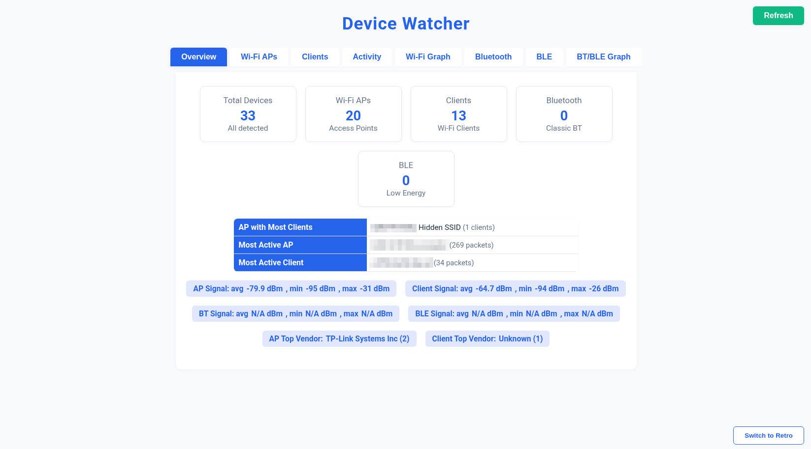

# DeviceWatcher

A Flask-based dashboard that monitors and visualises Wi-Fi, Bluetooth Classic, and BLE (Bluetooth Low Energy) interfaces in real time. Detected devices are stored in a local SQLite database and displayed in an AdminLTE web dashboard with interactive network graphs.

## Features

- **Wi-Fi** — beacon/probe/data-frame capture with full 802.11 IE parsing:
  - Wi-Fi generation (Wi-Fi 4/5/6/6E/7), spatial streams, country code
  - BSS Load (station count + channel utilisation), PMF status
  - 802.11k/v/r roaming capabilities, Hotspot 2.0 / Passpoint, 802.11s mesh detection
  - Probe SSID tracking — records the Preferred Network List broadcast by clients
  - BSSID group detection (multi-radio routers shown as one logical AP)
  - Real-time streaming camera detection via upstream bandwidth heuristics
  - UI channel-hopper controls (pause / lock to channel / resume)
- **Bluetooth Classic** — discovery via `hcitool` with CoD parsing:
  - Major + minor device class (Smartphone, Headphones, Keyboard, …) and service classes
  - Bluetooth LMP version and HCI chip manufacturer
- **BLE** — passive scan via `bleak` (no C extension compilation required):
  - TX power, connectable flag, estimated advertisement interval
  - iBeacon UUID / major / minor decoding
  - Eddystone URL and UID decoding
  - Apple Nearby Info device-type identification (iPhone, AirPods, Apple Watch, …)
  - Xiaomi MiBeacon temperature/humidity decoding
- **Analytics engine:**
  - Radar positioning — RSSI-based distance estimation for devices seen in the last 5 minutes
  - Occupancy histogram — hourly unique-device counts over the last 24 hours
  - Security threat scanner — WEP/TKIP networks, open APs, possible Evil-Twin attacks, streaming cameras
  - Entity clustering — multi-signal union-find algorithm correlating devices across Wi-Fi, BT Classic, and BLE
- AdminLTE 3 dashboard with DataTables, vis.js network graphs, and Chart.js charts
- MAC vendor resolution from a local IEEE OUI registry (MA-S / MA-M / MA-L); optional external API fallback
- Known-device enrichment via `MAC_Address_Device_List.csv`
- Optional Bearer-token authentication (`--auth-token`)
- Modular — start only the monitors you need with `--wifi`, `--bt`, `--ble`
- API documentation served at `/docs` (Doxygen, generated at Docker build time)

## Requirements

### Python

- Python 3.10 or later (tested on 3.11)

### System packages

| Package | Purpose |
|---------|---------|
| `bluez` | Provides `hcitool` for Bluetooth Classic scanning |
| `aircrack-ng` or `iw` | Put Wi-Fi adapter into monitor mode / channel hopping |
| `python3`, `python3-venv` | Python runtime and virtualenv support |
| `ieee-data` | Local IEEE OUI registry for vendor lookups (optional but recommended) |

Install on Debian/Ubuntu/Kali:

```bash
sudo apt install bluez iw aircrack-ng python3 python3-venv ieee-data
```

> **Note**: `libbluetooth-dev` and `libglib2.0-dev` are **not** required.
> The old `pybluez` / `bluepy` dependencies have been replaced with `bleak`
> (pure-Python, installs as a wheel) and subprocess-based `hcitool` for
> classic Bluetooth.

## Installation

### Quick setup (recommended)

```bash
git clone https://github.com/ManuRebelo/DeviceWatcher.git
cd DeviceWatcher
bash setup.sh
```

`setup.sh` will:
1. Check for required system packages and print what is missing
2. Create a Python virtualenv at `./venv/`
3. Install all Python dependencies from `requirements.txt`

Run `sudo bash setup.sh` to have the script install missing system packages automatically.

### Docker setup (recommended for production)

The provided `Dockerfile` uses a **multi-stage build**: the first stage installs
Doxygen, generates the API documentation, and then discards the toolchain.
The final runtime image contains the pre-built docs served at `/docs`.

> [!IMPORTANT]
> The container must run in **privileged** mode with **host networking** to
> access the host's Wi-Fi and Bluetooth hardware.

1. Build and start the container:
   ```bash
   docker compose up -d
   ```

2. By default the `ENTRYPOINT` starts DeviceWatcher with `--wifi wlan0mon --ble 1`.
   Override via the `command:` key in `docker-compose.yml`:
   ```yaml
   command: --wifi wlan1mon --bt 0 --ble 0
   ```

3. The SQLite database is persisted under `./data/` (mapped to `/app/data/` inside the container).

4. To require authentication, set the `DEVICEWATCHER_TOKEN` environment variable:
   ```bash
   DEVICEWATCHER_TOKEN=mysecret docker compose up -d
   ```

### Manual setup

```bash
git clone https://github.com/ManuRebelo/DeviceWatcher.git
cd DeviceWatcher

# Install system packages
sudo apt install bluez iw python3 python3-venv ieee-data

# Create virtualenv and install Python deps
python3 -m venv venv
venv/bin/pip install -r requirements.txt
```

## Wi-Fi monitor mode

Before starting Wi-Fi monitoring, put your wireless adapter into monitor mode:

```bash
sudo airmon-ng check kill      # kill processes that may interfere
sudo airmon-ng start wlan1     # creates wlan1mon (or similar)
# Optionally lock to a channel:
sudo iwconfig wlan1mon channel 6
```

Check available interfaces with `iwconfig` or `iw dev`.

## Usage

Raw socket capture requires root (or `CAP_NET_RAW`). Run with `sudo`:

```bash
# All monitors
sudo venv/bin/python DeviceWatcher.py --wifi wlan1mon --bt 0 --ble 0

# Wi-Fi only
sudo venv/bin/python DeviceWatcher.py --wifi wlan1mon

# BLE only
sudo venv/bin/python DeviceWatcher.py --ble 0

# Bluetooth Classic only
sudo venv/bin/python DeviceWatcher.py --bt 0
```

### CLI reference

| Argument | Value | Description |
|----------|-------|-------------|
| `--wifi` | interface name | Wi-Fi interface in monitor mode (e.g. `wlan1mon`) |
| `--bt` | HCI index | Bluetooth Classic adapter index (e.g. `0`, `1`) |
| `--ble` | HCI index | BLE adapter index (e.g. `0`, `1`) |
| `--host` | address | HTTP bind address (default `127.0.0.1`; use `0.0.0.0` for LAN access) |
| `--port` | integer | HTTP port (default `5000`) |
| `--auth-token` | string | Require this Bearer token on every request (falls back to `DEVICEWATCHER_TOKEN` env var) |
| `--oui-file` | path | Additional OUI source: Wireshark `manuf` file or IEEE-style CSV |
| `--enable-vendor-api` | flag | Allow fallback to macvendors.com / macvendorlookup.com for unknown MACs |

Check your Bluetooth adapter indices with:

```bash
hcitool dev
```

> **Security note**: when using `--host 0.0.0.0` to expose the dashboard on
> the LAN, always combine it with `--auth-token` (or the `DEVICEWATCHER_TOKEN`
> env var).  Without a token, anyone on the network can read the dashboard
> and delete device records.

## Web dashboard

Once running, open:

```
http://localhost:5000
```



## API documentation

The Doxygen-generated API reference is served by the application itself:

```
http://localhost:5000/docs
```

Documentation is generated automatically during the Docker build (multi-stage
Dockerfile) and can be regenerated locally with:

```bash
sudo apt install doxygen graphviz
doxygen Doxyfile
# output: docs/html/index.html
```

## Adding known devices

To enrich device data with brand/type information, add rows to `MAC_Address_Device_List.csv`:

```
MAC_Prefix,Brand,DeviceType,SpecificModels
AA:BB:CC,Apple,Smartphone,"iPhone 14, iPhone 15"
```

The prefix format is the first three colon-separated octets of the MAC address in uppercase.

## File structure

```
DeviceWatcher/
├── DeviceWatcher.py               # Flask app, CLI entry point, HTTP API
├── database_manager.py            # SQLite persistence layer (WAL, per-thread connections)
├── wifi_monitor.py                # Wi-Fi packet capture (Scapy + iw channel hopping)
├── bluetooth_classic_monitor.py   # BT Classic discovery (hcitool subprocess)
├── ble_monitor.py                 # BLE scanning (bleak / asyncio)
├── analytics_engine.py            # Radar, occupancy, security threats, entity clustering
├── ble_decoders.py                # BLE manufacturer-data frame decoders
├── utils.py                       # VendorResolver (IEEE OUI + optional API), CSV loader
├── Doxyfile                       # Doxygen configuration (output → docs/html/)
├── Dockerfile                     # Multi-stage: doc-builder + runtime
├── docker-compose.yml             # Host-network, privileged, D-Bus mount
├── .dockerignore                  # Excludes __pycache__, venv, docs/, etc.
├── .gitignore
├── setup.sh                       # Dependency check + virtualenv setup
├── requirements.txt               # Pinned Python dependencies
├── MAC_Address_Device_List.csv    # Known-device enrichment data
├── templates/
│   └── index.html                 # AdminLTE 3 dashboard (SPA)
├── static/
│   ├── js/main.js                 # Dashboard logic (vis.js, Chart.js, DataTables)
│   ├── main.css                   # Custom styles
│   ├── adminlte/                  # Locally-served AdminLTE 3.2 assets
│   └── vendor/                    # Other vendored JS/CSS
├── docs/
│   ├── architecture.md            # System architecture and component overview
│   ├── wifi-monitoring.md         # Wi-Fi monitoring deep-dive
│   ├── bluetooth-monitoring.md    # BLE and Bluetooth Classic deep-dive
│   └── html/                      # Generated by Doxygen (gitignored)
├── data/                          # Runtime SQLite database (gitignored, Docker volume)
└── images/                        # Dashboard screenshots
```

## Technical documentation

Detailed technical documentation lives in [`docs/`](docs/):

| Document | Contents |
|----------|---------|
| [`docs/architecture.md`](docs/architecture.md) | System overview, threading model, Flask API endpoints, database schema, data flow |
| [`docs/wifi-monitoring.md`](docs/wifi-monitoring.md) | Monitor mode setup, channel hopping, frame handling, IE parsing, BSSID grouping |
| [`docs/bluetooth-monitoring.md`](docs/bluetooth-monitoring.md) | BLE scan loop, service UUID mapping, BT Classic inquiry, Class of Device parsing |
| `/docs` (live) | Doxygen API reference — all modules, classes, and methods with call graphs |

## Troubleshooting

| Error | Fix |
|-------|-----|
| `hcitool not found` | `sudo apt install bluez` |
| `Permission denied` on socket | Run with `sudo` |
| Wi-Fi adapter not in monitor mode | Run `sudo airmon-ng start <iface>` |
| `No such file or directory: 'hciX'` | Check adapter index with `hcitool dev` |
| BLE: `org.bluez.Error.NotReady` | Bluetooth service not running: `sudo systemctl start bluetooth` |
| Port 5000 already in use | Use `--port <N>` to bind to a different port |
| `/docs` returns 404 | Run `doxygen Doxyfile` locally or rebuild the Docker image |
| Vendor lookups return "Unknown" | Install `ieee-data` (`sudo apt install ieee-data`) or use `--enable-vendor-api` |

## Notes

- All monitors are optional — omit an argument to skip that monitor entirely.
- The dashboard auto-refreshes device data every 60 seconds and signal readings every 30 seconds.
- The SQLite database is created automatically on first run under `data/` (or next to the script when running bare-metal).
- MAC addresses and network observation history in the database are restricted to owner-only permissions (0o600) automatically.

## Disclaimer

This tool is intended for educational and authorised network auditing purposes only. The author is not responsible for any misuse.

## License

MIT License
